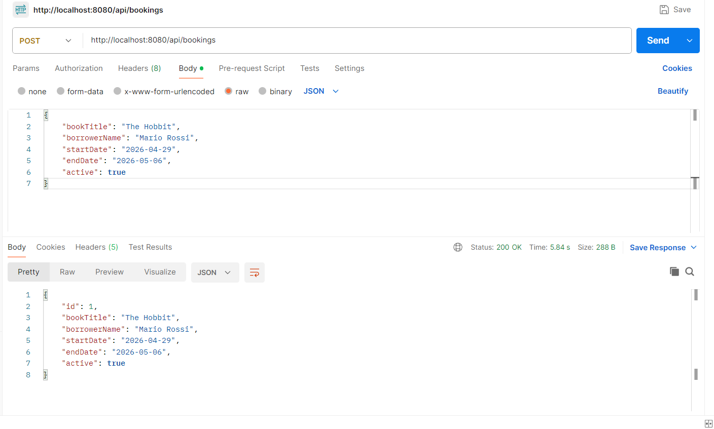
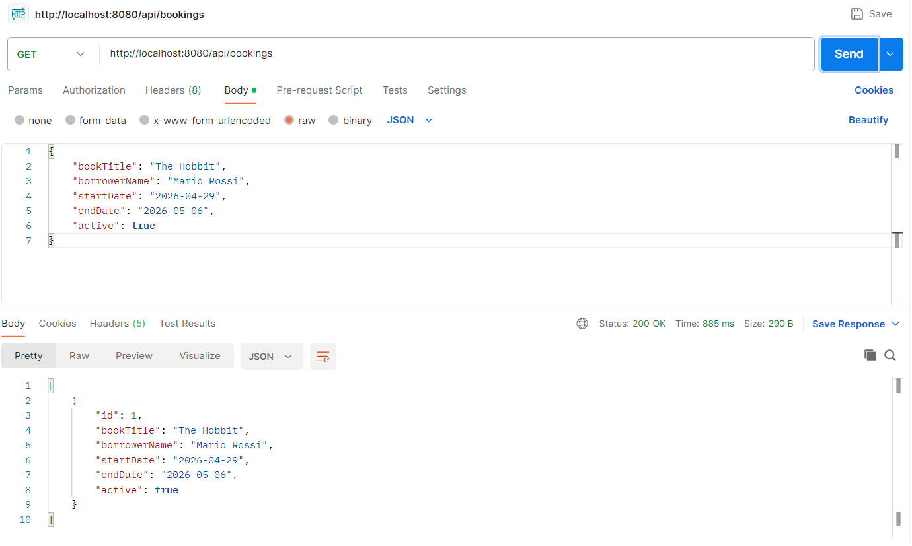
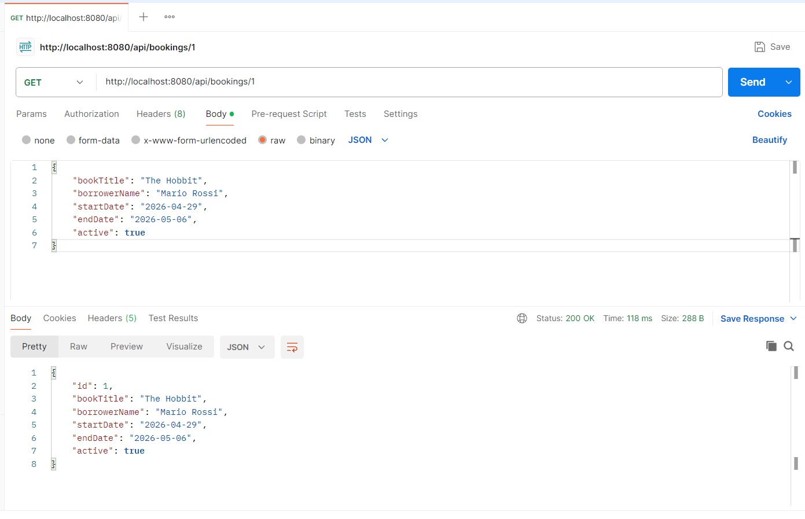
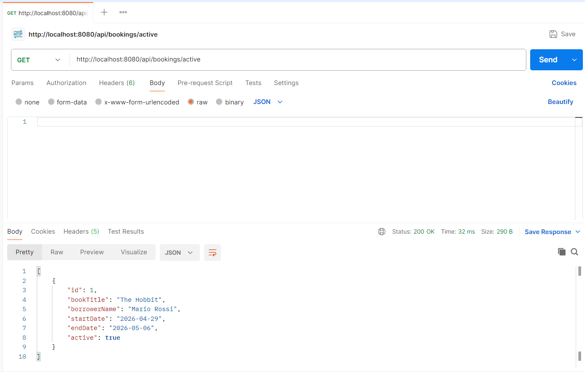
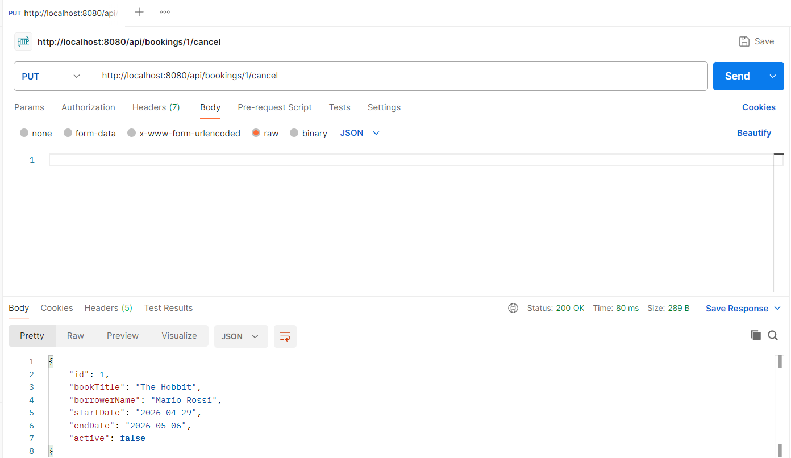
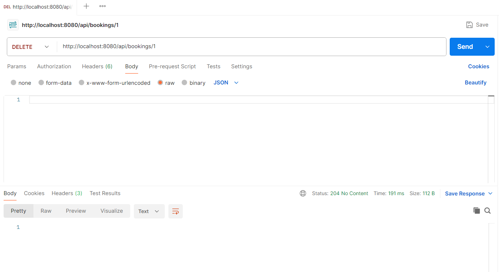
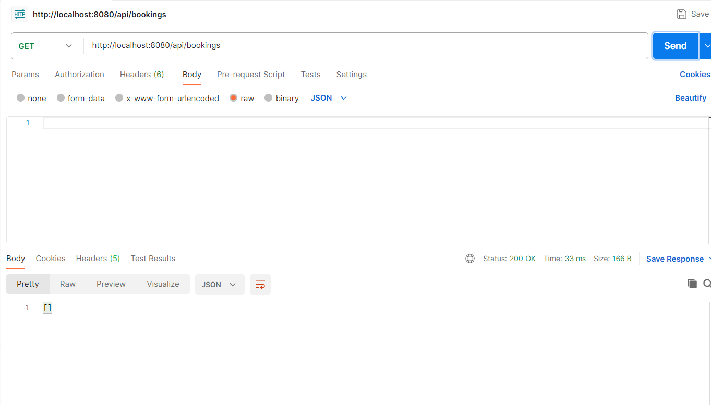
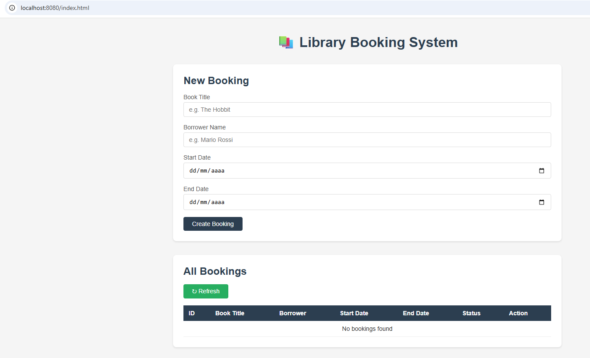
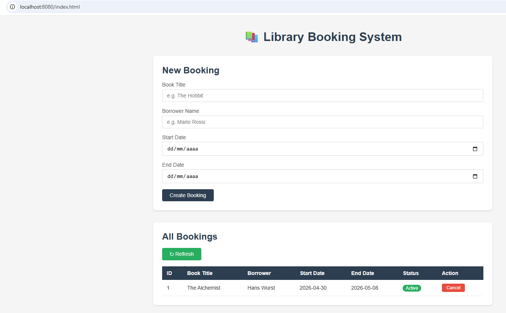
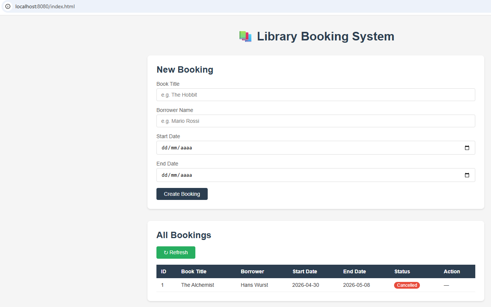

# 📚 Library Booking System

A Spring Boot REST API for managing book reservations,
built as the third component of the Community Library Platform.

## 🏛️ Community Library Platform

This project is part of a larger ecosystem:

| Project | Description | Repository |
|---|---|---|
| Library Management | Java console app for book catalog | [library-java](link) |
| Library REST API | Spring Boot API for book catalog | [todo-api](link) |
| Library Booking | This project — booking system | library-booking |

## Features
- Create and manage book reservations
- View all bookings or filter by book title
- View only active bookings
- Cancel bookings without losing history
- Delete bookings permanently
- Persistent storage via H2 in-memory database
- Layered MVC architecture

## Technologies
- Java 21
- Spring Boot 3.5.13
- Spring Data JPA
- H2 Database
- Maven
- Git & GitHub

## Agile Process
This project was developed following the **Scrum framework**:
- Work organized in a Sprint with a defined Sprint Goal
- User stories tracked in the Product Backlog
- Daily standup log maintained throughout development
- Sprint concluded with a Review and Retrospective

> Developer holds a Professional Scrum Master I (PSM I)
> certification issued by Scrum.org

## Architecture
```
controller  → receives HTTP requests
service     → applies business logic
repository  → talks to the database
model       → data structure
```

## API Endpoints

| Method | URL | Description |
|---|---|---|
| GET | /api/bookings | Get all bookings |
| GET | /api/bookings/{id} | Get booking by ID |
| GET | /api/bookings/book/{title} | Get bookings by book title |
| GET | /api/bookings/active | Get all active bookings |
| POST | /api/bookings | Create new booking |
| PUT | /api/bookings/{id}/cancel | Cancel a booking |
| DELETE | /api/bookings/{id} | Delete a booking |

## API Testing with Postman

All endpoints tested and verified with Postman.

### POST — Create a booking


### GET — All bookings


### GET — Booking by ID


### GET — Bookings by book title


### GET — Active bookings


### PUT — Cancel booking


### DELETE — Delete booking


### GET — All bookings after delete


## Web Frontend

A simple web interface served directly by Spring Boot
at http://localhost:8080/

### Empty page on startup


### Active booking in table


### Cancelled booking



## Future Development 🔮
- User authentication with Spring Security
- User login and registration
- Role-based access control (Admin vs User)

## How to Run
1. Clone the repository
   git clone https://github.com/yourusername/library-booking
2. Open the project in IntelliJ IDEA
3. Run LibraryBookingApplication.java
4. API available at http://localhost:8080/api/bookings
5. H2 console available at http://localhost:8080/h2-console

## Project Structure
```
src/main/java/
├── controller/    → BookingController.java
├── model/         → Booking.java
├── repository/    → BookingRepository.java
├── service/       → BookingService.java
└── library_booking/ → LibraryBookingApplication.java
```
